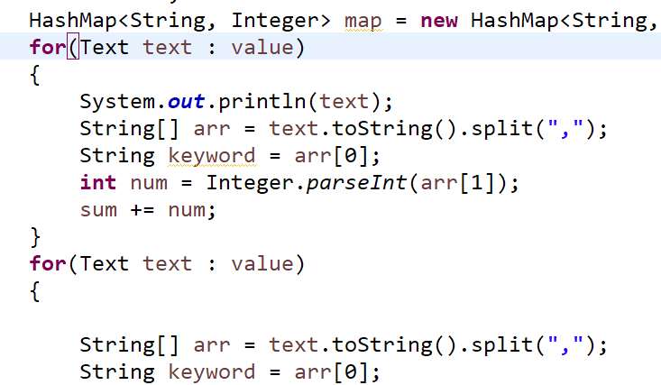

## 前言

　　这个博文只是记录一下在学习过程中遇到的一些小知识和小坑，并不是系统的教程，会不断的更新内容，大佬就请直接绕过！！/手动笑哭  

## 初识MapReduce

　　MapReduce是一种分布式计算模型，由Google提出，主要用于搜索领域，解决海量数据的计算问题，其解决海量数据的计算的思想是“分而治之”。

　　Hadoop分布式文件系统框架基于主从关系，一个名称结点和多个数据节点。主节点：namenode; 从节点，有很多个：datanode,其中：

　　namenode负责： 
　　　　接收用户操作请求 
　　　　维护文件系统的目录结构 
　　　　管理文件与block之间关系，block与datanode之间关系

　　datanode负责： 
　　　　存储文件 
　　　　文件被分成block存储在磁盘上 
　　　　为保证数据安全，文件会有多个副本

## MapReduce工作机制：

MapReduce 1.0版本中工作机制：

第9步单独启动一个结点的意义在于，与主要的结点隔离，出错也不影响它（类似于虚拟机之间互相不影响），jobtracker node 需要管理的东西太多，资源消耗太大，且它挂了，整个系统就挂了

MapReduce 2.0版本：

2.0中，ResourceManager只需要管结点调度就好啦，从1.0中把功能细分出来向ResourceManager要资源，然后告诉NodeManager，我需要运行一个任务!!! 启动spark或是其他的，只需要改AppMaster和一些代码

MapReduce的shuffle：

shuffle大致是描绘数据如何从 map task 输出到 reduce task 输入的这段过程，上图把MapReduce过程分成两个部分，实际上从两边的Map和Reduce到中间的那一大块都属于Shuffle过程，也就是说，Shuffle过程有一部分是在Map端，有一部分是在Reduce端。在Hadoop这样的集群环境中，大部分map task与reduce task的执行是在不同的节点上。所以很多情况下Reduce执行时需要跨节点去拉取其他节点上的map task结果，这样造成了集群内部的网络资源消耗很严重，而且在节点的内部，相比于内存，磁盘IO对性能的影响是非常严重的。如果集群正在运行的job有很多，那么task的正常执行对集群内部的网络资源消费会非常大。因此，对于MapReduce作业Shuffle过程的期望是：

>* 完整地从map task端拉取数据到Reduce端；
>* 在跨节点拉取数据时，尽可能地减少对带宽的不必要消耗
>* 减少磁盘IO对task执行的影响

待续。。。。

## 注意点

1. MapReduce仅仅基于键值对工作，输入为一组键值对，输出也是一组键值对，涵盖不同类型

(input) <k1, v1> -> map -> <k2, v2> -> combine -> <k2, v2> -> reduce -> <k3, v3> (output)

2. Key和Value类都需要去实现Writable接口，此外Key类必须实现WritableComparable接口来辅助排序

3. Map中第一个参数类型必须为LongWritable，或者为LongWritable的基类/接口

4. Mapper类负责将输入键值对转化为中间键值对，一个给定的输入键值对可以转化为0-n个中间键值对

5. 通过Job.setGroupingComparatorClass(Class)设置一个比较器实现排序；实现Partitioner来控制哪些key到哪个reducer；通过Job.setCombinerClass(Class)实现对中间输出的本地整合，帮助减少从Mapper到Reducer的数据量；

6. 注意指定输入输出路径的FileInputFormat和FileOutputFormat都是来自于org.apache.hadoop.mapreduce.lib库下，另外还有一个mapred的库下面包含同名类，无法使用。

7. 注意在主函数中指定Mapper和Reducer的全部输出类型。如 
　　　　job1.setMapOutputKeyClass(Text.class);  
　　　　job1.setMapOutputValueClass(Text.class);  
　　　　job1.setOutputKeyClass(Text.class);  
　　　　job1.setOutputValueClass(ArrayWritable.class);

默认会根据所指定的Reducer的输出类型推断Map的输出类型，如果二者不一致很容易导致出现类型不匹配的问题，因此建议全部明确指定输出类型。

8. 如下图那样编写的情况下，第二次循环中value已经为空。reduce时默认只能遍历一次。

9. 使用ArrayWritable作为输出类型时需要继承ArrayWritable并实现write函数，参考 https://www.cnblogs.com/yancey/p/3946513.html

10. sequentialFile文件读入时的key和value即为写入文件时的key和value

11. 执行任务前会执行setup函数进行初始化，执行任务后会在cleanup函数中进行结果的输出。如果需要设置全局参数需要在主函数调用时使用conf.set()添加到conf中，执行的时候使用conf.get()获取所设置的值。

12. 在cleanup中写出其他文件时若直接使用FileSystem fs = FileSystem.get(conf)；时默认为当前本地文件系统。即便当前目录下包含完整设置的hdfs-site.xml等文件也不行。

　　解决方案一：

　　configuration.addResource(new Path("/etc/hadoop/conf/core-site.xml"));
　　configuration.addResource(new Path("/etc/hadoop/conf/hdfs-site.xml"));

然后再获取FileSystem即可。注意必须使用Path类进行包装，否则无法识别相对路径。

　　解决方案二：

　　FileSystem fs = FileSystem.get(new URI("hdfs://hdp-node-01:9000"), conf);
通过在get方法中指定hdfs的URI（URL：端口号）来使得FileSystem指向hdfs文件系统。

　　详情参考： http://techidiocy.com/java-lang-illegalargumentexception-wrong-fs-expected-file/

13. 使用SequenceFile.Reader读取文件的时候要是用new方法新建对象

SequenceFile.Reader reader = new SequenceFile.Reader(fs, centerPath, conf);

IntWritable itemKey = new IntWritable();

Text itemValue = new Text();

注意读入时的key和value类型必须和写入的时候一致，且必须new创建，否则会出现类型不匹配或空指针错误。可能读取过程中为了节省资源会不断修改一个对象的值。使用while(reader.next(itemKey, itemValue))循环读取sequencialFile中的值。

14. 默认输出和输入类型均为TextFile，其中输入时key为每行的偏移量，而value为每行。如果需要修改输入和输出文件的类型，使用

　　job.setInputFormatClass(SequenceFileInputFormat.class);

　　job.setOutputFormatClass(SequenceFileOutputFormat.class);
