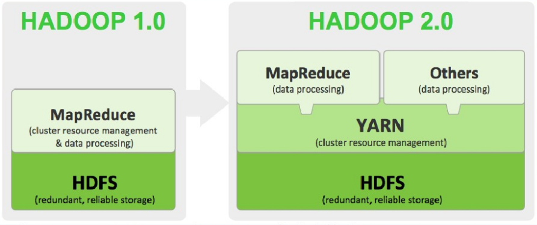

### 前言

　通过了这一段时间的学习，趁着新的一年，整理了一下自己的学习笔记以及理解，将这些内容发到自己的博客上，希望能对新入门的同学有所帮助，也希望有老司机能够指出理解不到位的地方，帮助我们我以及其他新司机一起不断进步。

### Hadoop基础

首先说下Hadoop的特点：
>* 扩容能力（Scalable）：能可靠地（reliably）存储和处理千兆字节（PB）数据。
>* 成本低（Economical）：可以通过普通机器组成的服务器群来分发以及处理数据。这些服务器群总计可达数千个节点。
>* 高效率（Efficient）：通过分发数据，hadoop可以在数据所在的节点上并行地（parallel）处理它们，这使得处理非常的快速。
>* 可靠性（Reliable）：hadoop能自动地维护数据的多份副本，并且在任务失败后能自动地重新部署（redeploy）计算任务。

hadoop1.0与hadoop2.0的对比：



可以从图中看出，Hadoop1.0时代，MapReduce的功能很复杂，既要负责集群的资源管理又要处理数据，耦合度很高，到了2.0时代，Hadoop框架将原先的MapReduce的庞大功能模块细分出来，让YARN来管理集群的资源调度，MapReduce就专注与处理数据逻辑，这样不仅仅解耦合，YARN还支持结合其他的数据处理组件，大大增强了框架的可复用性。
　　

　　其他什么介绍之类虚的东西就不说了，直接进入正题，首先是Hadoop平台的搭建，创建的用户名是hadoop：

1. 准备Linux环境：

　　因为没有条件组成真正的分布式集群，所以只有用虚拟机来实现伪分布式集群的搭建。这里我使用的虚拟机是VMware，Linux是CentOS6.5发行版。安装Linux虚拟机就不赘述了，这里说一下虚拟机连接外面实体机网络的设置，首先到VM这软件的虚拟网络编辑器中设置VMnet8的子网IP和子网掩码,桥接方式我这边选的是NAT模式，如下图所示：


然后回到Windows下，打开网络和共享中心 -> 更改适配器设置,如下图所示：


　　这样就设置好虚拟机联网问题了。emmm.... 刚好有NAT模式为啥这样配置的原理图，这里贴上来，但是就不解释说明了，大家应该都懂！！


2. 修改虚拟机主机名：

　　vim /etc/sysconfig/network

　　NETWORKING=yes

　　HOSTNAME=hdp-node-01      ### 这里修改主机名，永久修改，重启后生效

3. 修改IP：

　　因为要搭建集群，所以IP不能使用动态获取方式，而要设置为静态IP。这里有两种修改方式：

　　第一种：通过Linux图形界面进行修改

　　进入Linux图形界面 -> 右键点击右上方的两个小电脑 -> 点击Edit connections -> 选中当前网络System eth0 -> 点击edit按钮 -> 选择IPv4 -> method选择为manual -> 点击add按钮 -> 添加IP：192.168.33.101 子网掩码：255.255.255.0 网关：192.168.33.1 -> apply

　　第二种：修改配置文件方式

　　vim /etc/sysconfig/network-scripts/ifcfg-eth0

　　BOOTPROTO="static"    ##这里要改成静态方式

　　IPADDR="192.168.3.101"

　　NETMASK="255.255.255.0"

　　GATEWAY="192.168.33.1" 

以上列出的是要修改的，其他可以不去动它。如果发现没有ifcfg-eth0 配置文件的话，原因是centos6改用NetworkManager方式管理网络了，可以运行如下命令进行确认：

　　chkconfig --list | grep -i netw

结果如下：

　　NetworkManager 0:off 1:off 2:on 3:on 4:on 5:on 6:off    //不同级别登陆的状态

　　network 0:off 1:off 2:off 3:off 4:off 5:off 6:off

　　这里可以看到，NetworkManager是开机启动状态，network是关闭状态。解决办法就是关闭NetworkManager，用传统的network方式来管理网络，并补充上ifcfg-eth0文件即可

　　修复步骤如下：

　　#关闭NetworkManager服务：$ service NetworkManager stop

　　#关闭NetworkManager开机启动：$ chkconfig NetworkManager off

　　#添加 /etc/sysconfig/network-scripts/ifcfg-eth0 文件

　　DEVICE=eth0     #描述网卡对应的设备别名

　　BOOTPROTO=static    #设置网卡获得IP地址方式，可选的选项为static、DHCP或bootp，分别对应静态指定的IP地址，通过DHCP协议获得IP地址，通过bootp协议获得IP地址

　　IPADDR=146.175.139.13    #IP地址

　　NETMASK=255.255.255.0  #网卡对应的网络掩码

　　GATEWAY=146.175.139.255   #网关IP

　　HWADDR=00:25:90:81:5e:64   #MAC地址

　　NM_CONTROLLED=no      #表示该接口将通过该配置文件进行设置，而不是通过网络管理器进行管理

　　ONBOOT=yes    #表示系统将在启动时开启该接口

　　TYPE=Ethernet

　　IPV6INIT=no

　　注：文件内容的值根据实际情况修改

　　#开机启动network：$ chkconfig network on

　　#开启network服务：

　　　　service network start

　　　　service network restart

这样就可以生效了


4. 修改主机名和IP的映射关系

　　192.168.33.101      hdp-node-01

　　192.168.33.102      hdp-node-02

　　192.168.33.103      hdp-node-03

　　这里我配置了三台虚拟机，所以一次性全写上了。

5. 关闭防火墙

　　#查看防火墙状态：service iptables status

　　#关闭防火墙：service iptables stop

　　#查看防火墙开机启动状态：chkconfig iptables --list

　　#关闭防火墙开机启动：chkconfig iptables off

可以使用 setup 命令来启动文字模式配置实用程序，来关闭防火墙

6. 给普通用户添加sudo权限

　　一般不介意直接使用root用户来进行集群上的操作，所以需要创建一个普通用户，如hadoop用户，给其分配权限。步骤如下：

　　#进入root用户模式：su -

　　#添加用户：adduser hadoop

　　#修改密码：passwd hadoop

　　#添加sudoers文件写权限：[root@localhost ~]# chmod u+w /etc/sudoers 

　　#添加hadoop用户到sudoers文件里：在"root ALL=(ALL) ALL"这行下添加"hadoop ALL=(ALL) ALL".

```bash
[root@localhost ~]# vim /etc/sudoers
.........................
.........................
root    ALL=(ALL)   ALL
hadoop    ALL=(ALL)   ALL   <-----添加到这里. :wq保存退出
.........................
.........................
```

　　#撤销sudoers写权限，记得撤销写权限：[root@localhost ~]# chmod u-w /etc/sudoers

7. 配置SSH免密登陆：

　　因为集群需要从master机器自动帮我们从slaves机器中启动东西，所以需要配置一下SSH免密登陆。

```bash
#生成ssh免登陆密钥
#进入到我的home目录
cd ~/.ssh

ssh-keygen -t rsa （四个回车,都表示默认）
执行完这个命令后，会生成两个文件id_rsa（私钥）、id_rsa.pub（公钥）
将公钥拷贝到要免登陆的机器上
ssh-copy-id localhost
```

　　网上找了一个免密登陆的机制原理图，感觉画的不错：


8. 安装JDK：

　　#先将jdk安装包上传到虚拟机中，上传工具使用xshell附带的xftp就行

　　#解压jdk

　　　　· 创建文件夹：mkdir /home/hadoop/apps

　　　　· 解压：tar -zxvf jdk1.8.0_144 -C /home/hadoop/apps

　　#将Java添加到环境变量中

```bash
vim /etc/profile

#在文件最后添加
export JAVA_HOME=/home/hadoop/apps/jdk1.8.0_144
export PATH=$PATH:$JAVA_HOME/bin

#刷新配置文件,使环境变量生效
. /etc/profile
```

9. 安装hadoop：

　　先上传hadoop的安装包到服务器上去

　　#配置hadoop的环境变量
```bash
vi /etc/profile
export JAVA_HOME=/usr/java/jdk1.8.0_144
export HADOOP_HOME=/itcast/hadoop-2.8.1
export PATH=$PATH:$HADOOP_HOME/bin:$HADOOP_HOME/sbin

#刷新配置文件
. /etc/profile
```

　　伪分布式需要修改5个配置文件($HADOOP_HOME/etc/hadoop/下)

　　#第一个：hadoop-env.sh

```bash
vi hadoop-env.sh
#添加Java的环境变量路径
export JAVA_HOME=${JAVA_HOME}
```

　　#第二个：core-site.xml

```xml
<!-- 指定HADOOP所使用的文件系统schema（URI），HDFS的老大（NameNode）的地址 -->
<property>
    <name>fs.defaultFS</name>
    <value>hdfs://weekend-1206-01:9000</value>
</property>
<!-- 指定hadoop运行时产生文件的存储目录 -->
<property>
    <name>hadoop.tmp.dir</name>
    <value>/home/hadoop/hadoop-2.4.1/tmp</value>
</property>
```

　　#第三个：hdfs-site.xml(mv hdfs-default.xml hdfs-site.xml)

```xml
<!-- 指定HDFS副本的数量 -->
<property>
    <name>dfs.replication</name>
    <value>3</value>
</property>
<!-- 指定集群文件存储路径 -->
<property>
    <name>dfs.name.dir</name>
    <value>/home/hadoop/apps/hadoop-2.4.1/ClusterData</value>
</property>
```

　　#第四个：mapred-site.xml(mv mapred-site.xml.template mapred-site.xml)

```xml
<!-- 指定mr运行在yarn上 -->
<property>
    <name>mapreduce.framework.name</name>
    <value>yarn</value>
</property>
```

　　#第五个：yarn-site.xml
```xml
<!-- 指定YARN的老大（ResourceManager）的地址 -->
<property>
    <name>yarn.resourcemanager.hostname</name>
    <value>hdp-node-01</value>
</property>
<!-- reducer获取数据的方式 -->
<property>
    <name>yarn.nodemanager.aux-services</name>
    <value>mapreduce_shuffle</value>
</property>
```

　　最后在修改一下 slaves 文件，这个文件是表示hadoop集群中从结点的机器是哪些，master机器启动时会查看此文件，依次帮我们去启动这些从节点作为datanode，只要在这个文件里面加入需要作为datanode的主机名即可，如：
```bash
vi slaves

hdp-node-01
hdp-node-02
hdp-node-03
```

　　在master上配置好后，需要将hadoop复制到其他结点的机器上，这样就省的再配置一次了：scp -r hadoop-2.8.1 hadoop@hdp-node-02:/home/hadoop/apps

　　配置好后，首次启动需要格式化namenode，对namenode进行初始化：hdfs namenode -format

　　初始化成功后，启动hadoop：

```bash
#启动HDFS
start-dfs.sh

#启动YARN
start-yarn.sh
```

　　验证是否成功：使用 jps 命令验证，如果有NameNode、Jps、SecondaryNameNode、NodeManager、ResourceManager、DataNode这些进程，就说明启动成功。可以通过 http://192.168.33.101:50070 （HDFS管理界面）和 http://192.168.33.101:8088 （MR管理界面）访问UI管理界面，其中50070和8088是默认端口号。

### HDFS Shell

```bash
#查看帮助
hadoop fs -help <cmd>

#上传
hadoop fs -put <linux上文件> <hdfs上的文件>

#查看文件内容
hadoop fs -cat <hdfs上的路径>

#下载文件
hadoop fs -get <hdfs上的路径> <linux上文件>

#HDFS Shell 基本使用和linux指令类似，这里就不过多赘述了
```

### hadoop核心

>* HDFS：Hadoop Distributed File System 分布式文件系统
>* YARN：Yet Another Resource Negotiator 资源管理调度系统
>* MapReduce：分布式运算框架

### HDFS

HDFS的架构：


>* 主从结构

　　主节点：NameNode/Secondary NameNode

　　从节点，有很多个：datanode

>* namenode负责：

　　接收用户操作请求

　　维护文件系统的目录结构

　　管理文件与block之间关系，block与datanode之间关系

>* datanode负责：

　　存储文件

　　文件被分成block存储在磁盘上

　　为保证数据安全，文件会有多个副本

### NameNode

>* NameNode是整个文件系统的管理节点。它维护着整个文件系统的文件目录树，文件/目录的元信息和每个文件对应的数据块列表。接收用户的操作请求。
>* 文件包括：

　　1.fsimage：元数据镜像文件。存储某一时段NameNode内存元数据信息

　　2.edits：操作日志文件

　　3.fstime：保存最近一次checkpoint的时间

以上数据保存在服务器的文件系统中(也就是hdfs-site.xml的dfs.name.dir所设置的路径下)

>* NameNode元数据管理机制


namenode中会记录一个文件在HDFS上的名称，在集群上有几份，分别在哪几台DataNode上等信息。

#### NameNode的工作特点

>* Namenode始终在内存中保存metadata，用于处理“读请求”
>* 有“写请求”到来时，namenode会首先写editlog到磁盘，即向edits文件中写日志，成功返回后，才会修改内存，并且向客户端返回
>* Hadoop会维护一个fsimage文件，也就是namenode中metadata的镜像，但是fsimage不会随时与namenode内存中的metadata保持一致，而是每隔一段时间通过合并edits文件来更新内容。SecondaryNamenode就是用来合并fsimage和edits文件来更新NameNode的metadata的。


SecondaryNameNode是HA的一个解决方案，但是不支持热备份，合并流程如上图
>* secondary通知namenode切换edits文件，此时主节点产生edits.new
>* secondary通过http get方式从namenode获得fsimage和edits文件(在secondaryNamenode的current同级目录下可见到temp.check-point或者previous-checkpoint目录，这些目录中存储着从namenode拷贝来的镜像文件)
>* secondary将fsimage开始合并获取的上述两个文件，产生一个新的fsimage文件fsimage.ckpt
>* secondary将新的fsimage通过http post方式发送回NameNode
>* namenode将fsimage.ckpt与edits.new文件分别重命名为fsimage与edits，然后更新fstime，整个checkpoint过程到此结束。

#### 什么时候checkpoint

>* fs.checkpoint.period指定两次checkpoint的最大时间间隔，默认3600秒
>* fs.checkpoint.size 规定edits文件的最大值，一旦超过这个值则强制checkpoint，不管是否达到最大时间间隔。默认大小是64M。

上述配置可在core-site.xml中配置

### HDFS读过程


1. 初始化FileSystem，然后客户端(client)用FileSystem的open()函数打开文件
2. FileSystem用RPC调用元数据节点，得到文件的数据块信息，对于每一个数据块，元数据节点返回保存数据块的数据节点的地址。
3. FileSystem返回FSDataInputStream给客户端，用来读取数据，客户端调用stream的read()函数开始读取数据。
4. DFSInputStream连接保存此文件第一个数据块的最近的数据节点，data从数据节点读到客户端(client)
5. 当此数据块读取完毕时，DFSInputStream关闭和此数据节点的连接，然后连接此文件下一个数据块的最近的数据节点。
6. 当客户端读取完毕数据的时候，调用FSDataInputStream的close函数。
7. 在读取数据的过程中，如果客户端在与数据节点通信出现错误，则尝试连接包含此数据块的下一个数据节点。
8. 失败的数据节点将被记录，以后不再连接。


### HDFS写过程


1. 初始化FileSystem，客户端调用create()来创建文件
2. FileSystem用RPC调用元数据节点，在文件系统的命名空间中创建一个新的文件，元数据节点首先确定文件原来不存在，并且客户端有创建文件的权限，然后创建新文件。
3. FileSystem返回DFSOutputStream，客户端用于写数据，客户端开始写入数据。
4. DFSOutputStream将数据分成块，写入data queue。data queue由Data Streamer读取，并通知元数据节点分配数据节点，用来存储数据块(每块默认复制3块)。分配的数据节点放在一个pipeline里。Data Streamer将数据块写入pipeline中的第一个数据节点。第一个数据节点将数据块发送给第二个数据节点。第二个数据节点将数据发送给第三个数据节点。
5. DFSOutputStream为发出去的数据块保存了ack queue，等待pipeline中的数据节点告知数据已经写入成功。
6. 当客户端结束写入数据，则调用stream的close函数。此操作将所有的数据块写入pipeline中的数据节点，并等待ack queue返回成功。最后通知元数据节点写入完毕。
7. 如果数据节点在写入的过程中失败，关闭pipeline，将ack queue中的数据块放入data queue的开始，当前的数据块在已经写入的数据节点中被元数据节点赋予新的标示，则错误节点重启后能够察觉其数据块是过时的，会被删除。失败的数据节点从pipeline中移除，另外的数据块则写入pipeline中的另外两个数据节点。元数据节点则被通知此数据块是复制块数不足，将来会再创建第三份备份。

#### hadoop中的RPC框架机制


　　其实就是，客户端与服务端都实现同一个接口，然后通过socket来进行通信，利用Java的动态反射来拿到实例对象进行远程过程调用，这里由于要进行socket传输信息，所以要进行序列化封装。序列化(Serialization)是指把结构化对象转化为字节流，方便网络传输，而反序列化(Deserialization)是序列化的逆过程。即把字节流转回结构化对象。
>* RPC——远程过程调用协议，它是一种通过网络从远程计算机程序上请求服务，而不需要了解底层网络技术的协议。RPC协议假定某些传输协议的存在，如TCP或UDP，为通信程序之间携带信息数据。在OSI网络通信模型中，RPC跨越了传输层和应用层。RPC使得开发包括网络分布式多程序在内的应用程序更加容易。
>* RPC采用客户机/服务器模式。请求程序就是一个客户机，而服务提供程序就是一个服务器。首先，客户机调用进程发送一个有进程参数的调用信息到服务进程，然后等待应答信息。在服务器端，进程保持睡眠状态直到调用信息的到达为止。当一个调用信息到达，服务器获得进程参数，计算结果，发送答复信息，然后等待下一个调用信息，最后，客户端调用进程接收答复信息，获得进程结果，然后调用执行继续进行。
>* hadoop的整个体系结构就是构建在RPC之上的

#### Hadoop的序列化：Writable接口

1. Writable接口，是根据DataInput和DataOutput实现的简单、有效的序列化对象
2. MR的任意Key和Value必须实现Writable接口
3. MR的任意key必须实现WritableComparable接口


所以如果需要在MapReduce中的key、value使用自定义的Bean，则此Bean对象需要实现Writable接口。

### DataNode
>* datanode是提供真实文件数据的存储服务
>* 文件块(block):最基本的存储单位。对于文件内容而言，一个文件的长度大小是size，那么从文件的0偏移开始，按照固定的大小，顺序对文件进行划分并编号，划分好的每一个块称一个Block。HDFS默认Block大小是128M，以一个256MB文件为例，这个文件共有 256/128=2个Block。可以在dfs.block.size属性中设置


### MapReduce

#### MapReduce概述

>* MapReduce是一种分布式计算模型，由Google提出，主要用于搜索领域，解决海量数据的计算问题
>* MR由两个阶段组成：Map和Reduce，用户只需要实现map()和reduce()两个函数，即可实现分布式计算，非常简单
>* Map和Reduce这两个函数的形参是key、value对，表示函数的输入信息

#### MapReduce原理


##### map任务处理
>* 读取输入文件内容，解析成key、value对。对输入文件的每一行，解析成key、value对。每一个键值对调用一次map函数。
>* 写自己的逻辑，对输入的key、value处理，转换成新的key、value输出
>* 每次读取一行的数据，以文本偏移量作为key，这一行的内容作为value，组合成一个k-v对作为Map的输入

##### reduce任务处理
>* 在reduce之前，有一个shuffle的过程对多个map任务的输出进行合并、排序。
>* 写reduce函数自己的逻辑，对输入的key、value处理，转换成新的key、value输出。
>* 把reduce的输出保存到文件中


##### map、reduce键值对格式
| 函数  | 输入键值对    | 输出键值对    |
| -------   | -----:    | :----:    |
| map() | <k1,v1>   | <k2,v2>   |
| reduce()  | <k2,{v2...}    | <k3,v3>  |

##### MR过程各个角色的作用

>* jobClient:是用户作业与JobTracker交互的主要接口。负责提交作业、启动、跟踪任务执行、访问任务状态和日志等
>* JobTracker:负责接收用户提交的作业，负责启动、初始化任务、跟踪任务执行，分配作业，TaskTracker与其进行通信，协调监控整个作业
>* TaskTracker:定期与JobTracker通信，执行Map和Reduce任务
>* HDFS:保存作业的数据、配置、jar包、结果


　　当我们写好mapreduce程序打包成jar包后，在集群的中，使用 hadoop jar 主类名  指令来提交任务，程序中最后的job.waitforcompletion() 才是真正提交任务，这段代码之前是配置信息，配置完成后通过JobClient提交，与JobTracker通信得到一个jar的存储路径和JobId，然后进行输入输出路径检查，将jobjar拷贝到HDFS，计算输入分片，将分片信息写入到job.split中，然后会写一个job.xml文件，这些操作做完才真正提交作业。

　　客户端提交作业后，RM的JobTracker会将作业加入到队列，然后进行调度，默认是FIFO方式。NM的TaskTracker与JobTracker之间的会通过心跳机制来进行通信和任务分配，TaskTracker会主动定期向JobTracker发送心跳信息，询问是否有任务要做，如果有，就会申请到任务，然后RM会分配给他们运行资源，RM会启动一个NM作为MRAppMaster，由它来调度map或reduce的任务进程(yarnChild)，多少个任务进程，jsp的时候就可以看到几个yarnChild进程。在map任务完成后，会通知MRAppMaster，由它启动reduce任务，完成任务后，会将结果数据写入到HDFS中，MRAppMaster会向RM注销自己，RM会回收资源。一次任务完成。

　　当然，Task会定期向TaskTracker汇报执行情况，TaskTracker会定期收集所在集群上的所有Task的信息，并向JobTracker汇报，JobTracker会根据所有TaskTracker汇报上来的信息进行汇总。如果TaskTracker出错了，就会停止向JobTracker发送心跳信息，那么JobTracker会将TaskTracker从等待的任务池中移除，并将该任务转移到其他的地方执行。同样的，如果一个任务执行很长时间还没有结果，JobTracker会起另外一个TaskTracker来执行同一个任务，哪个完成的快就采用哪个的结果，取消另一个的执行。


#### Shuffle


1. 每个map有一个环形内存缓冲区，用于存储任务的输出。默认大小100MB(io.sort.mb属性设置),一旦达到阀值0.8(io.sort.spill.percent可设置)，一个后台线程就把内容写到(spill)磁盘的指定目录(mapred.local.dir)下的新建的一个溢出写文件
2. 写磁盘前，会进行分组(partition)和排序(sort)。如果设定了合并(combiner)程序，则进行合并再将数据分组排序。
3. 等最后记录写完，合并全部溢出写文件为一个分区且排序的文件
4. Reducer通过http方式得到输出文件的分区，每个Reduce拉取属于自己要处理的分组数据
5. TaskTracker为分区文件运行Reduce任务。复制阶段把Map输出复制到Reducer的内存或磁盘。一个Map任务完成，Reduce就开始复制输出
6. 排序阶段合并map输出。然后走Reduce阶段

以上过程就包含了shuffle的执行。从流程中可以看出，我们可以自己控制排序和分组的过程。在map和reduce阶段进行排序，默认情况下，比较的是key的值，value是不参与排序比较的。如果要想让value也参与排序，需要把key与value组装成新的类，作为key，才能参与比较。同样，分组时默认也是按照key进行比较的。

#### Partitioner && Combiners
>* Partitioner

　　Partitioner<K,V>是partitioner的基类，如果需要定制partitioner需要继承该类。Partition所处的位置如下所示：


　　Partition主要作用就是将map的结果发送到相应的reduce，所以要求partition要做到负载均衡，尽量的将工作均匀的分配给不同的reduce，以及保持效率，分配速度一定要快。HashPartitioner是mapreduce的默认partitioner。计算方法是 reducer = =(key.hashCode() & Integer.MAX_VALUE) % numReduceTasks，以此来得到当前的目的reducer。


>* Combiners

　　每一个map可能会产生大量的输出，combiner的作用就是在map端对输出先做一次合并，以减少传输到reduce的数据量。combiner最基本的实现是实现本地key的归并，combiner具有类似本地的reduce功能。如果不使用combiner，那么，所有的结果都是reduce完成，效率会相对低下。使用combiner，先完成的map会在本地聚合，提升速度。

注意：Combiner的输出是Reducer的输入，如果Combiner是可插拔的，添加Combiner绝对不能改变最终的计算结果。所以Combiner只应该用于那种Reduce的输入key/value与输出key/value类型完全一致，且不影响最终结果的场景。比如累加，最大值等。


### Hadoop整体框架


　　上图显示了一个MR程序的完整流程，可以看到这个前后有一个InputFormat和OutFormat组件，由这两个组件来与数据的输入和输出有关(FileInputFormat.setInputPaths(job, new Path(args[0]))与FileOutputFormat.setOutputPath(job, new Path(args[1])))。InputFormat与OutputFormat都只是接口，将Map的数据输入与真实的数据读取之间相隔开，这样就可以适应不同的文件系统来使用Map程序，同样OutputFormat将Reduce的数据输出与真实的文件系统相隔开，使之适应于不同的文件系统。这样就将MapReduce框架与数据的读写完全解耦合。InputFormat与OutputFormat都有一个默认的实现类，分别为TextInputFormat与TextOutputFormat，也就是读取文本文件，和写文本文件。如果要处理其他类型的数据或者换一种方法读取文本数据，则需要自己去实现一种读取写入的类。

　　InputFormat会将数据分成很多切片(split)，然后每个切片会用一个RecordReaders类来读取数据封装成k-v对给map接收，一个切片就对应一个map进程。同样，OutputFormat输出的时候也是由一个RecordWriters来写数据磁盘文件。

　　在写mapreduce程序的时候，可以把mapred-site.xml、yarn-site.xml等配置文件复制到项目中，省去conf单独配置太多配置项的麻烦。

#### MapReduce的输入输出处理类


>* FileInputFormat

　　FileInputFormat是所有以文件作为数据源的InputFormat实现的基类，FileInputFormat保存作为job输入的所有文件，并实现了对输入文件计算splits的方法。至于获得记录的方法是由不同的之类(如TextInputFormat)进行实现的。

　　InputFormat负责处理MR的输入部分：


其起到以下作用：

1. 验证作业的输入是否规范
2. 把输入文件切分成InputSplit
3. 提供RecordReader的实现类，把InputSplit读到Mapper中进行处理

>* InputSplit

　　在执行mapreduce之前，原始数据被分割成若干split，每个split作为一个map任务的输入，在map执行过程中split会被分解成一个记录(key-value对)，map会依次处理每一个记录。

　　FileInputFormat只划分比HDFS block大的文件，所以FileInputFormat划分的结果是这个文件或是这个文件中的一部分。如果一个文件的大小比block小，将不会被划分，这也是Hadoop处理大文件的效率要比处理小文件的效率高的原因。

　　当Hadoop处理很多小文件(文件大小小于hdfs block大小)的时候，由于FileInputFormat不会对小文件进行划分，所以每一个小文件都会被当作一个split并分配一个mao任务，导致效率低下。

　　比如：一个1GB的文件，会被划分成16个64MB的split，并分配16个map任务处理，而10000个100kb的文件会被10000个map任务处理。

>* TextInputFormat

　　TextInputFormat是默认的处理类，处理普通文本文件，文件中每一行作为一个记录，它将每一行在文件中的起始偏移量作为key，每一行的内容作为value；它默认以 \n 或回车键作为一条记录。当然，TextInputFormat继承了FileInputFormat。

　　InputFormat类的层次结构如下所示：


>* 其他输入类 & 自定义输入格式

　　Hadoop的输入类有很多，下面就简单的列举几个：

1. CombineFileInputFormat：相对于大量的小文件来说，hadoop更适合处理少量的大文件。CombineFileInputFormat可以缓解这个问题，它是针对小文件而设计的。
2. KeyValueTextInputFormat：当输入数据的每一行是两列，并用tab分离的形式的时候，KeyValueTextInputformat处理这种格式的文件非常适合。
3. NLineInputFormat：NLineInputformat可以控制在每个split中数据的行数。
4. SequenceFileInputFormat：当输入文件格式是sequencefile的时候，要使用SequenceFileInputformat作为输入。
5. 自定义输入格式：如果要自定义输入格式的话，需要自己写一个类，继承FileInputFormat基类，并重写里面的getSplits(JobContext context)方法，以及重写createRecordReader(InputSplit split,TaskAttemptContext context)方法。

>* MapReduce的输出

　　输出方面简单的说几个输出类，大致和输入类似：

1. TextOutputFormat：默认的输出格式，key和value中间值用tab隔开的。 
2. SequenceFileOutputFormat：将key和value以sequencefile格式输出。 
3. SequenceFileAsOutputFormat：将key和value以原始二进制的格式输出。 
4. MapFileOutputFormat：将key和value写入MapFile中。由于MapFile中的key是有序的，所以写入的时候必须保证记录是按key值顺序写入的。
5. MultipleOutputFormat：默认情况下一个reducer会产生一个输出，但是有些时候我们想一个reducer产生多个输出，MultipleOutputFormat和MultipleOutputs可以实现这个功能。

### zookeeper